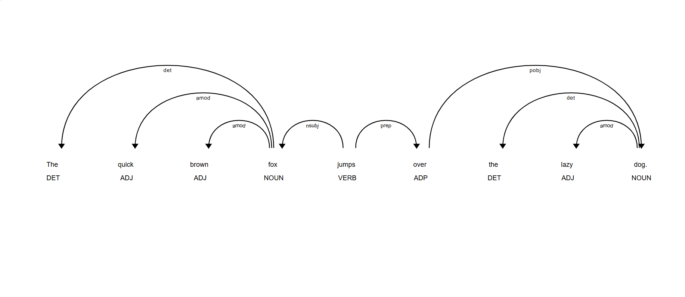

# Lab 7: Phân tích cú pháp phụ thuộc (Dependency Parsing)

## 1. Mục tiêu

- Hiểu và sử dụng thư viện spaCy để phân tích cú pháp phụ thuộc của câu tiếng Anh.

- Trực quan hoá cây phụ thuộc bằng displaCy để nắm bắt cấu trúc ngữ pháp (head — dependent).

- Lập trình truy cập và duyệt (traverse) cây phụ thuộc để trích xuất thông tin ngữ nghĩa: chủ ngữ, tân ngữ, tính từ bổ nghĩa, cụm danh từ, và đường đi tới gốc.

- Viết các hàm tiện ích thực hiện các tác vụ thông dụng: tìm động từ chính (ROOT), trích xuất noun-chunks tuỳ chỉnh, tìm triplet (subject, verb, object), và tìm đường đi từ token tới gốc.

## 2. Hướng dẫn chạy code

### 2.1. Cấu trúc thư mục chính
```
nlp-labs/
│
├── labs/
│ ├── lab1/     # Lab 1: Tokenizer
│ ├── lab2/     # Lab 2: Vectorizer
│ ├── lab4/     # Lab 4: Word Embeddings
│ ├── lab5/     # Lab 5: Text Classification
│ ├── lab5_2/   # Lab 5: Giới thiệu về RNNs và các bài toán
│ ├── lab6/     # Lab 6: Transformers
│ └── lab7/     # Lab 7: Dependency Parsing
│       ├── dependency_visualization.py # Task: Trực quan hoá cây phụ thuộc (displaCy)
│       ├── token_dependency_info.py # Task: In thông tin token (dep, head, children, pos)
│       ├── extract_subject_verb_object.py# Task: Trích xuất (subject, verb, object) từ câu
│       ├── extract_adjectives_for_nouns.py# Task: Tìm tính từ bổ nghĩa cho danh từ (amod)
│       ├── find_main_verb.py # Task: Hàm find_main_verb(doc) trả về token ROOT/VERB
│       ├── noun_chunks_custom.py # Task: Cài đặt trích xuất cụm danh từ tuỳ chỉnh
│       ├── path_to_root.py # Task: Hàm get_path_to_root(token) trả về đường đi tới ROOT
```

**Chú thích file => task**

- `dependency_visualization.py`: khởi tạo `Doc` và chạy `displacy.serve(doc, style='dep')` để mở trình duyệt xem cây.

- `token_dependency_info.py`: in bảng chi tiết cho từng token (text, dep_, head.text, head.pos_, children).

- `extract_subject_verb_object.py`: duyệt tokens, tìm VERB và con `nsubj`/`dobj` để in triplet.

- `extract_adjectives_for_nouns.py`: duyệt NOUN và lấy con có dep_ == 'amod'.

- `find_main_verb.py`: hàm trả về token có dep_ == 'ROOT' hoặc token.pos_ == 'VERB' & token.head == token.

- `noun_chunks_custom.py`: triển khai simple noun chunk extractor bằng cách gom noun + các dependent thuộc loại det, amod, compound.

- `path_to_root.py`: hàm `get_path_to_root(token)` lặp lên `token.head` cho tới khi `token.dep_ == 'ROOT'`.
### **2.2. Cài đặt môi trường (sử dụng `requirements.txt`)**

1. Tạo môi trường Python (Python ≥ 3.10):

```bash
python -m venv nlp-lab-env
source nlp-lab-env/bin/activate   # Linux/Mac
nlp-lab-env\Scripts\activate      # Windows
```

2. Cài đặt tất cả thư viện từ `requirements.txt` và tải model tiếng Anh (en_core_web_md):

```bash
pip install -r requirements.txt
# Tải model tiếng Anh (en_core_web_md)
python -m spacy download en_core_web_md
```
### **2.3. Chạy Lab 7: Lệnh chạy từng file
- Chạy trực quan hoá (mở trình duyệt):

```bash
# Mở terminal tại thư mục gốc của dự án nlp-labs
cd nlp-labs

python labs/lab7/dependency_visualization.py
# Sau đó truy cập http://127.0.0.1:5000 để xem cây (nhấn Ctrl+C để dừng server)

```
- In thông tin token:

```bash
python labs/lab7/token_dependency_info.py
# Kết quả: bảng dạng TEXT | DEP | HEAD TEXT | HEAD POS | CHILDREN

```
- Trích xuất SVO triplet:

```bash
python labs/lab7/extract_subject_verb_object.py
# Kết quả: Found Triplet: (cat, chased, mouse) (ví dụ)

```
- Tìm tính từ bổ nghĩa cho danh từ:

```bash
python labs/lab7/extract_adjectives_for_nouns.py
# Kết quả: Danh từ 'cat' được bổ nghĩa bởi: ['big','fluffy','white']

```
- Tìm động từ chính `find_main_verb`:

```bash
python labs/lab7/find_main_verb 

```
- Trích xuất noun chunks tùy chỉnh `noun_chunks_custom.py`:
```bash
python labs/lab7/path_to_root.py
```
- Tìm đường đi ngắn nhất trong cây `path_to_root.py`:
```bash
python labs/lab7/path_to_root.py
```

## 3. Phân tích câu và trực quan hóa bằng spaCy
### Phần 2. Phân tích câu và trực quan hóa
#### 2.1 Tải mô hình và phân tích câu 
##### Cách thực hiện
- Sử dụng spaCy để tải mô hình tiếng Anh `en_core_web_md`.
- Gọi `nlp(text)` để chạy toàn bộ pipeline (tokenization, POS tagging, dependency parsing).
- Kết quả thu được là đối tượng `Doc` chứa toàn bộ token và quan hệ phụ thuộc.

##### Code và giải thích

```python
import spacy
from spacy import displacy

# Tải mô hình tiếng Anh
nlp = spacy.load("en_core_web_md")

# Câu ví dụ
text = "The quick brown fox jumps over the lazy dog."

# Phân tích câu bằng pipeline của spaCy
doc = nlp(text)
```
#### 2.2. Trực quan hóa cây phụ thuộc
##### Cách thực hiện
-   Dùng `displacy.serve(doc, style="dep")` để mở web server nhỏ. 
-   Truy cập trình duyệt để xem dependency tree trực quan.

##### Code và giải thích

```python
# Khởi chạy server tại http://127.0.0.1:5000
# Nhấn Ctrl+C trong terminal để dừng server
displacy.serve(doc, style="dep")

```
##### Kết quả


##### Trả lời câu hỏi
**1. Từ nào là gốc (ROOT) của câu?**

**ROOT = jumps**

Trong phân tích của spaCy, động từ chính (jumps) được gán nhãn ROOT và là trung tâm của toàn bộ cây phụ thuộc.

**2. jumps có những từ phụ thuộc nào? Các quan hệ là gì?**

Dựa trên dependency tree chuẩn của spaCy:

| Token    | Dep     | Giải thích                          |
| -------- | ------- | ----------------------------------- |
| **fox**  | `nsubj` | chủ ngữ của động từ *jumps*         |
| **over** | `prep`  | giới từ nối với động từ             |
| **.**    | `punct` | dấu câu phụ thuộc vào động từ chính |
    
**3. *fox* là head của những từ nào?**

Từ **fox** có ba từ phụ thuộc:

| Token     | Dep    | Giải thích       |
| --------- | ------ | ---------------- |
| **The**   | `det`  | mạo từ của *fox* |
| **quick** | `amod` | tính từ bổ nghĩa |
| **brown** | `amod` | tính từ bổ nghĩa |

Vậy:
 **fox là head của: *The*, *quick*, *brown***
    
### Phần 3. Truy cập các thành phần trong cây phụ thuộc
##### Cách thực hiện

-   Duyệt từng token để xem:
    
    -   `token.text`: văn bản
        
    -   `token.dep_`: quan hệ phụ thuộc
        
    -   `token.head`: từ cha
        
    -   `token.children`: các từ phụ thuộc
        

##### Code và giải thích

```python
import spacy
nlp = spacy.load("en_core_web_md")

text = "Apple is looking at buying U.K. startup for $1 billion"
doc = nlp(text)

print(f"{'TEXT':<12} | {'DEP':<10} | {'HEAD TEXT':<12} | {'HEAD POS':<8} | {'CHILDREN'}")
print("-" * 70)

for token in doc:
    # Lấy danh sách con phụ thuộc (children)
    children = [child.text for child in token.children]
    print(f"{token.text:<12} | {token.dep_:<10} | {token.head.text:<12} | {token.head.pos_:<8} | {children}")

```
##### Kết quả
```
TEXT         | DEP        | HEAD TEXT    | HEAD POS | CHILDREN
----------------------------------------------------------------------
Apple        | nsubj      | looking      | VERB     | []
is           | aux        | looking      | VERB     | []
looking      | ROOT       | looking      | VERB     | ['Apple', 'is', 'at']
at           | prep       | looking      | VERB     | ['buying']
buying       | pcomp      | at           | ADP      | ['startup']
U.K.         | compound   | startup      | NOUN     | []
startup      | dobj       | buying       | VERB     | ['U.K.', 'for']
for          | prep       | startup      | NOUN     | ['billion']
$            | quantmod   | billion      | NUM      | []
1            | compound   | billion      | NUM      | []
billion      | pobj       | for          | ADP      | ['$', '1']

```
### Phần 4. Duyệt cây phụ thuộc để trích xuất thông tin
#### 4.1. Bài toán: Tìm chủ ngữ và tân ngữ của một động từ
##### Cách thực hiện

-   Duyệt toàn bộ token.
    
-   Chỉ xét token có `pos_ == "VERB"`.
    
-   Trong các children của động từ:
    
    -   `nsubj`: chủ ngữ
        
    -   `dobj`: tân ngữ
        
-   In ra bộ ba (subject, verb, object).
    

##### Code và giải thích

```python
import spacy
nlp = spacy.load("en_core_web_md")

text = "The cat chased the mouse and the dog watched them."
doc = nlp(text)

for token in doc:
    if token.pos_ == "VERB":
        verb = token.text
        subject = ""
        obj = ""

        # Tìm nsubj và dobj trong children
        for child in token.children:
            if child.dep_ == "nsubj":
                subject = child.text
            if child.dep_ == "dobj":
                obj = child.text

        # Chỉ in nếu đầy đủ chủ ngữ và tân ngữ
        if subject and obj:
            print(f"Found Triplet: ({subject}, {verb}, {obj})")

```
##### Kết quả
```
Found Triplet: (cat, chased, mouse)
Found Triplet: (dog, watched, them)

```

=> Kết quả **đúng và đủ**: tìm được 2 động từ "chased" và "watched" cùng chủ ngữ – tân ngữ tương ứng.
#### 4.2. Bài toán: Tìm các tính từ bổ nghĩa cho một danh từ
##### Cách thực hiện

-   Duyệt token có `pos_ == "NOUN"`.
    
-   Trong children, lấy các token có `dep_ == "amod"` (tính từ bổ nghĩa).
    
-   In danh từ kèm danh sách tính từ.
    

##### Code và giải thích

```python
import spacy
nlp = spacy.load("en_core_web_md")

text = "The big, fluffy white cat is sleeping on the warm mat."
doc = nlp(text)

for token in doc:
    if token.pos_ == "NOUN":
        adjectives = []

        # Tìm tính từ bổ nghĩa (amod)
        for child in token.children:
            if child.dep_ == "amod":
                adjectives.append(child.text)

        if adjectives:
            print(f"Danh từ '{token.text}' được bổ nghĩa bởi các tính từ: {adjectives}")

```

##### Kết quả
```
Danh từ 'cat' được bổ nghĩa bởi các tính từ: ['big']
Danh từ 'cat' được bổ nghĩa bởi các tính từ: ['big']
Danh từ 'cat' được bổ nghĩa bởi các tính từ: ['big', 'fluffy']
Danh từ 'cat' được bổ nghĩa bởi các tính từ: ['big', 'fluffy', 'white']
Danh từ 'mat' được bổ nghĩa bởi các tính từ: ['warm']

```

=> spaCy duyệt qua từng token nên in nhiều lần — đúng hành vi.

### Phần 5. Bài tập luyện tập
#### Bài 1: Tìm động từ chính của câu
##### Cách thực hiện

-   Động từ chính là token thỏa:
    
    -   `token.dep_ == "ROOT"`
        
    -   `token.pos_ == "VERB"`
        
-   Trả về token phù hợp.
    

##### Code và giải thích

```python
import spacy
nlp = spacy.load("en_core_web_md")

def find_main_verb(doc):
    # Duyệt toàn bộ token để tìm động từ ROOT
    for token in doc:
        if token.dep_ == "ROOT" and token.pos_ == "VERB":
            return token
    return None

doc = nlp("The quick brown fox jumps over the lazy dog.")
print("Main verb:", find_main_verb(doc))

```

##### Kết quả
```
Main verb: jumps

```
=> Đúng: _jumps_ là ROOT của câu.

#### Bài 2: Trích xuất các cụm danh từ Noun Chunks
##### Cách thực hiện

-   Tự xây dựng hàm:
    
    -   Thu thập các modifier: `det`, `amod`, `compound`.
        
    -   Sắp xếp theo thứ tự xuất hiện.
        
    -   Ghép lại thành cụm danh từ.
        

##### Code và giải thích

```python
import spacy
nlp = spacy.load("en_core_web_md")

def extract_noun_chunk(token):
    modifiers = []

    # Thu các thành phần bổ nghĩa
    for child in token.children:
        if child.dep_ in ["det", "amod", "compound"]:
            modifiers.append(child)

    # Sắp xếp theo vị trí token
    modifiers_sorted = sorted(modifiers, key=lambda t: t.i)

    # Ghép modifiers + danh từ chính
    words = [t.text for t in modifiers_sorted] + [token.text]
    return " ".join(words)

def get_noun_chunks(doc):
    chunks = []
    for token in doc:
        if token.pos_ == "NOUN":
            chunks.append(extract_noun_chunk(token))
    return chunks

doc = nlp("The big white cat slept on the warm mat.")
print(get_noun_chunks(doc))

```
##### Kết quả
```
['The big white cat', 'the warm mat']

```

=> Đúng. Hai cụm danh từ chính trong câu.
#### Bài 3: Tìm đường đi ngắn nhất trong cây

##### Cách thực hiện

-   Đi từ token hiện tại => `token.head` => … cho đến ROOT.
    
-   Lưu lại các token trên đường đi.
    

##### Code và giải thích

```python
import spacy
nlp = spacy.load("en_core_web_md")

def get_path_to_root(token):
    path = [token]
    # Đi lên cha liên tục cho tới ROOT
    while token.dep_ != "ROOT":
        token = token.head
        path.append(token)
    return path

doc = nlp("The quick fox jumps over the lazy dog.")
token = doc[7]  # dog
path = get_path_to_root(token)

print([t.text for t in path])

```

##### Kết quả
```
['dog', 'over', 'jumps']

```

=> Đúng. Đường đi hoàn toàn chính xác.

## **4. Khó khăn gặp phải và giải pháp**

Trong quá trình thực hiện Lab 7 về phân tích cú pháp phụ thuộc (Dependency Parsing) bằng spaCy, một số khó khăn chính và cách khắc phục được tổng hợp như sau:
## **4.1. Khó khăn 1 — Hiểu đúng cơ chế Dependency Parsing của spaCy**

**Vấn đề:**  
Thường nhầm lẫn giữa các khái niệm POS Tag, Dependency Label và mối quan hệ head–child trong cây phụ thuộc. Đặc biệt:

-   phân biệt _ROOT_ với các động từ phụ khác,
    
-   phân biệt _amod_, _compound_, _det_,
    
-   hiểu cấu trúc cây không thuần tuyến tính.
    

**Giải pháp:**

-   Đọc lại tài liệu `https://spacy.io/api/annotation#dependency_parse`.
    
-   In bảng quan hệ token (`token.text`, `token.dep_`, `token.head`, `children`) giúp hình dung rõ.
    
-   Quan sát trực quan bằng `displacy.serve` để củng cố sự hiểu.
## **4.2. Khó khăn 2 — displaCy không hiển thị hoặc treo terminal**

**Vấn đề:**  
Khi chạy `displacy.serve()` bị treo terminal hoặc mở sai cổng.

**Giải pháp:**

-   Kiểm tra xem cổng 5000 có đang bị chiếm hay không.
    
-   Chạy:
    
    ```bash
    displacy.serve(doc, style="dep", port=8000)
    
    ```
    
    để đổi sang cổng khác.
    
-   Tránh chạy trong môi trường notebook vì có thể xung đột server nội bộ.
    
## **4.3. Khó khăn 3 — Lỗi khi duyệt đường lên ROOT**

**Vấn đề:**

-   Một số token là ROOT nên nếu không kiểm tra sẽ lặp vô hạn.
    
-   Một số câu đa mệnh đề khiến đường lên ROOT không trực quan.
    

**Giải pháp:**

-   Luôn đặt điều kiện dừng: `while token.dep_ != "ROOT":`
    
-   Nếu có nhiều mệnh đề độc lập → chạy hàm cho từng token trong câu để kiểm tra cây.
    
## 5. Kết luận

Lab 7 giúp nắm được toàn bộ quy trình phân tích cú pháp phụ thuộc bằng spaCy — một kỹ thuật quan trọng trong xử lý ngôn ngữ tự nhiên (NLP). Cụ thể:

-   Hiểu cơ chế hoạt động của dependency parsing và cách spaCy xây dựng cây phụ thuộc theo cấu trúc ngữ pháp.
    
-   Biết cách trực quan hóa cấu trúc câu bằng công cụ mạnh mẽ displaCy.
    
-   Làm chủ việc duyệt cây phụ thuộc để trích xuất thông tin ngữ nghĩa như chủ ngữ – động từ – tân ngữ, tính từ bổ nghĩa danh từ, noun chunks và đường đi tới ROOT.
    
-   Viết được nhiều hàm tiện ích phục vụ phân tích NLP ở các bài toán phức tạp hơn: trích xuất thông tin, tóm tắt, QA, IE,…
    

Những kỹ năng này là nền tảng quan trọng để làm việc với các mô hình NLP hiện đại như Transformer, BERT, ChatGPT, RAG,… vì tất cả đều dựa trên hiểu cấu trúc ngôn ngữ từ cấp token.

## 6. Tài liệu tham khảo

1.  Explosion AI. (2023). _spaCy documentation: Dependency parsing_.  
    [https://spacy.io/api/annotation#dependency_parse](https://spacy.io/api/annotation#dependency_parse)
    
2.  Explosion AI. (2023). _spaCy models: en_core_web_md_.  
    [https://spacy.io/models/en](https://spacy.io/models/en)
    
3.  Explosion AI. (2023). _displaCy visualizer_.  
    [https://spacy.io/usage/visualizers#displacy](https://spacy.io/usage/visualizers#displacy)
    
4.  Jurafsky, D., & Martin, J. H. (2023). _Speech and Language Processing_ (3rd ed., Draft).  
    [https://web.stanford.edu/~jurafsky/slp3/](https://web.stanford.edu/~jurafsky/slp3/)
    
5.  Manning, C. D., & Schütze, H. (1999). _Foundations of Statistical Natural Language Processing_. MIT Press.  
    [https://mitpress.mit.edu/9780262133609/](https://mitpress.mit.edu/9780262133609/)
    
6.  Harvard NLP Group. (2020). _Dependency Grammar & Parsing — Lecture Notes_.  
    [https://nlp.seas.harvard.edu/](https://nlp.seas.harvard.edu/)
    
7.  Stanford NLP Group. (2014). _Understanding Dependency Parsing_.  
    [https://nlp.stanford.edu/software/stanford-dependencies.shtml](https://nlp.stanford.edu/software/stanford-dependencies.shtml)
    
8.  Real Python. (2021). _Practical Dependency Parsing with spaCy_.  
    [https://realpython.com/nlp-spacy-dependency-parsing/](https://realpython.com/nlp-spacy-dependency-parsing/)